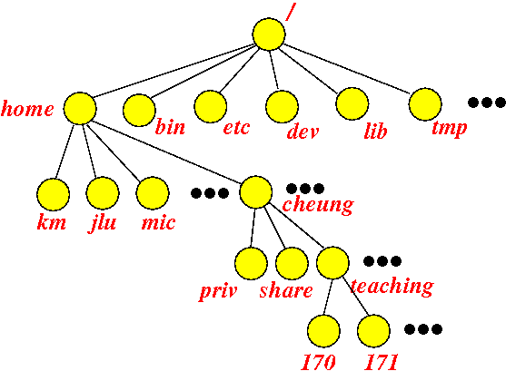

# Lab1 

## Lab reading material: (read them before the lab session)
- [Interacting with a computer (in general)](http://www.mathcs.emory.edu/~cheung/Courses/170/Syllabus/02/interact-computer.html)
- [Interacting with a UNIX computer: Navigating through the directory tree](http://www.mathcs.emory.edu/~cheung/Courses/170/Syllabus/02/cd-UNIX-dirs.html)

## Tasks

- Log in 
- Demonstrate the unix commands
- Help students with the exercise

## 1. Introduction

- Log in with your Emory ID and password

## 2. Getting started with a UNIX computer system

- Start the terminal
- Start firefox
- Start file browser

Next, go back to terminal and try commands below: 

#### Change to bash
```sh
$ bash
```

You should be able to see:
```sh
bash-4.1$
```

#### Print your current working directory
```sh
bash-4.1$ pwd
/home/glai2
```

#### List contents of the current directory
```sh
bash-4.1$ ls
anaconda2  cs551  cs559  cs572	    Downloads  priv    sunhome	    tmp
cs526	   cs554  cs563  Desktop    Music      Public  Templates    Videos
cs534	   cs557  cs571  Documents  Pictures   share   tensoreuler  workspace
```

## 3. Understanding directory in UNIX system

Symbol|Directory represented by the symbol
---|---
/ | The root directory
~ | The home directory of the user, for example: /home/glai2 
. | The current (working) directory
.. | The parent directory of the current directory



#### Print the root directory
```sh
bash-4.1$ ls / 
aut	boot  home   lost+found  mnt  proc  selinux  sys  var
backup	dev   lib    media	 net  root  srv      tmp
bin	etc   lib64  misc	 opt  sbin  sunhome  usr
```

#### Print your home directory
```sh
bash-4.1$ ls ~
cs170  cs534  cs554  cs559  cs571  Desktop    Downloads  Pictures  Public  sunhome    tensoreuler  Videos
cs526  cs551  cs557  cs563  cs572  Documents  Music	 priv	   share   Templates  tmp	   workspace
bash-4.1$ ls ~/
cs170  cs534  cs554  cs559  cs571  Desktop    Downloads  Pictures  Public  sunhome    tensoreuler  Videos
cs526  cs551  cs557  cs563  cs572  Documents  Music	 priv	   share   Templates  tmp	   workspace
bash-4.1$ ls .
cs170  cs534  cs554  cs559  cs571  Desktop    Downloads  Pictures  Public  sunhome    tensoreuler  Videos
cs526  cs551  cs557  cs563  cs572  Documents  Music	 priv	   share   Templates  tmp	   workspace
bash-4.1$ ls
cs170  cs534  cs554  cs559  cs571  Desktop    Downloads  Pictures  Public  sunhome    tensoreuler  Videos
cs526  cs551  cs557  cs563  cs572  Documents  Music	 priv	   share   Templates  tmp	   workspace
```

#### Print the parent directory of your home directory
```
bash-4.1$ ls ..
cs455001  glai2  jgimble  km  sche422  sguzze2	tsj
bash-4.1$ ls ../
cs455001  glai2  jgimble  km  sche422  sguzze2	tsj
```
You can see users exist in the same home directory

Next, it shows how to navigate directory. 

#### Go the home directory first
```sh
bash-4.1$ cd ../
bash-4.1$ pwd
/home
bash-4.1$ cd ../
bash-4.1$ pwd
/
```

- Why? 

In UNIX system, there are two kinds of path: **absolute** path and **relative** path

- What is the relative path?

Relative path is defined as path related to the present working directory(pwd).

-  What is an absolute path?

An absolute path is defined as the specifying the location of a file or directory from the root directory(/). In other words we can say absolute path is a complete path from start of actual filesystem from / directory.

For example:

I want to go to the `/home` directory from my current directory. 

- absolute path
```sh
bash-4.1$ pwd
/home/glai2
bash-4.1$ cd /home
bash-4.1$ pwd
/home
```

- relative path
```sh
bash-4.1$ pwd
/home/glai2
bash-4.1$ cd ../
bash-4.1$ pwd
/home
bash-4.1$
```

#### The defaule action of `cd`
```sh
bash-4.1$ cd
bash-4.1$ pwd
/home/glai2
```

Next, we will learn how to create directory. First go back to your user directory by `cd`. 
```sh
bash-4.1$ cd
bash-4.1$ pwd
/home/glai2
```

#### Create directory `cs170` by `mkdir` command

```sh
bash-4.1$ pwd
/home/glai2
# make sure you are in your user dir
bash-4.1$ ls
cs526  cs551  cs557  cs563  cs572    Documents	Music	  priv	  share    Templates	tmp	workspace
cs534  cs554  cs559  cs571  Desktop  Downloads	Pictures  Public  sunhome  tensoreuler	Videos
bash-4.1$ mkdir cs170
bash-4.1$ ls
cs170  cs534  cs554  cs559  cs571  Desktop    Downloads  Pictures  Public  sunhome    tensoreuler  Videos
cs526  cs551  cs557  cs563  cs572  Documents  Music	 priv	   share   Templates  tmp	   workspace
bash-4.1$
```

#### If you want to remove the directory, you can use `rmdir`
```sh
bash-4.1$ rmdir cs170/
```

Or you can use absolute path

```sh
bash-4.1$ rmdir cs170/home/glai2
```

## Exercise:

Create a `bob` directory under `cs170`
> Hint: `/home/glai2/cs170/bob`

Create a `sally` directory under `cs170`
> Hint: `/home/glai2/cs170/sally`

Navigate to `bob` directory and perform this command:
```sh
touch photo
```

You should see this:

```sh
bash-4.1$ ls /home/glai2/cs170/bob/
photo
```

Navigate to `sally` directory and perform this command:
```sh
touch music
```

You should see this:

```sh
bash-4.1$ ls /home/glai2/cs170/sally/
music
```

Navigate to `bob` directory and list file in `sally` directory. 
```sh
bash-4.1$ ls ../sally
music
```

Navigate to `sally` directory and list file in `bob` directory. 
```sh
bash-4.1$ ls ../bob
photo
```

## Assignment:

- Open browser
- Login to your emory email
- Send an email to gary.lai@emory.edu
  - Subject: lab1 - EMORYID
    - for example: lab1 - glai2
  - Body:
  In the body of the email, copy-and-paste the terminal window contents (the result of whatever commands, mistakes OK).

How to copy-and-paste in UNIX:

- To copy from the terminal, you first select the text with the left mouse button (it scrolls, so you can select more than just the visible text).

- Copy the selected text with Control-Shift-E (or the Edit menu, or the "Copy" button),

- Now paste the copied text into the webmail message (with Control-V, or the "Paste" key)