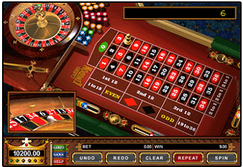
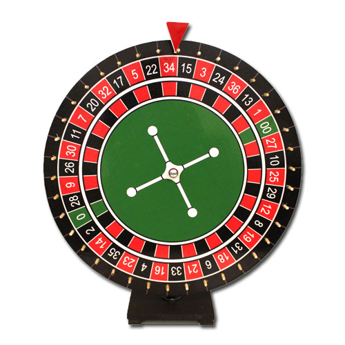
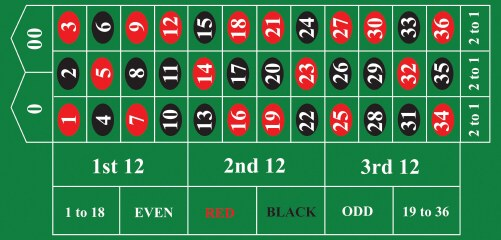

# Lab 10

## Goals:

- Learn Abstract Data Type (ADT)

Please, make sure that you have added the honor code statement at the top of your Java file:

```java
/*
  THIS CODE IS MY OWN WORK, IT WAS WRITTEN WITHOUT CONSULTING       
  CODE WRITTEN BY OTHER STUDENTS. _Your_Name_Here_
*/
```

## Preparation: Create your ~/cs170/lab10/, and copy files

```sh
bash
mkdir ~/cs170/lab10
cp  ~cs170001/share/lab10/*  ~/cs170/lab10
cd ~/cs170/lab10
```

Descriptions of the files copied:

- `Roulette.java`: this file will contain the definition of the roulette table
(it will contain: (1) variables to hold information on the roulette table, and (2) methods that make the program behave like a roulette table)

`Test1.java`, `Test2.java`, `Test3.java`, `Test4.java`, and `Test5.java`: test programs to check if you have implemented various aspects of the roulette table correctly.

## Intro: Abstract Data Type (ADT)

- An abstract data type is commonly known as a class of objects
- An abstract data type in a program is used to represent (the behavior) of some class of object in the real world

- In this lab, we will define (= write the definition) of an abstract data type (called Roullet) that represents (the behavior) Roulette tables in the real world
- A computer program will never be able to represent a real Roullete table
- What a computer program can do is represent the functionality of a Roullete table. So we need to know how a Roullete table is used.

#### How to play roulette:


> Roulette Table


> Roulette Wheel


> Betting Area


- People places bets in the betting area
- The dealer spins the roulette wheel and place a ball inside.
- The ball will land on some number and each number has an associated color
- The bets are checked if they match the outcome.
- Bets are paid out differently depending on the chance of winning.

In this lab, we will write a class Roullete that can represent (= simulate) spinning of the roulette wheel.

## Assignment:

### Task 1 representing a roulette table

The function of a roulette table is to produce one of the following 38 possible outcomes:

- Special outcome

value|color
---|---
0 | Green
00 | Green

- 1 to 36

value|color|value|color|value|color|value|color
---|---|---|---|---|---|---|---|
1 | Red | 11 | Black | 19 | Red | 29 | Black
2 | Black | 12 | Red | 20 | Black | 30 | Red
3 | Red | 13 | Black | 21 | Red | 31 | Black
4 | Black | 14 | Red | 22 | Black | 32 | Red
5 | Red | 15 | Black | 23 | Red | 33 | Black
6 | Black | 16 | Red | 24 | Black | 34 | Red
7 | Red | 17 | Black | 25 | Red | 35 | Black
8 | Black | 18 | Red | 26 | Black | 36 | Red
9 | Red | | | 27 | Red | |
10| Black | | | 28 | Black | |

- The "normal" outcomes are between 1 and 36, but there are 2 special outcomes: 0 and 00
- Every outcome has a color associated with the outcome.
- The "normal outcomes" (between 1 and 36) are either red or black
- The "special outcomes" (0 and 00) are green.


We will use 2 arrays to store information to represent all these 38 outcomes

```java
public class Roulette {  
  public String[] value;  // Variables to represent
  public String[] color;  // the Roullete table

  public int outcome;
  /* ================================================
    Task 1: write the constructor
  ================================================ */
  public Roulette() {

  }

  // .... (other methods omitted)
}
```

> I used `public` to define the variables value and color so that you can run the test program `Test1.java`. We will change the access specifier from public to private later in the lab...

The constructor method `Roulette()` must create (with the `new` operator) an array of 38 elements for value: to store the 38 values "0", "1", "2", ..., "35", "36", "00"

The constructor method `Roulette()` must create (with the `new` operator ) an array of 38 elements for color: to store the 38 values "G", "R", "B", "R", "B", ... ("G" means green, "R" means red and "B" means black)

#### Test

```sh
$ javac Test1.java
$ java Test1
Test1: constructor method in class Roulette
value[0] = 0 color[0] = G  value[1] = 1 color[1] = R
value[2] = 2 color[2] = B  value[3] = 3 color[3] = R
value[4] = 4 color[4] = B  value[5] = 5 color[5] = R
value[6] = 6 color[6] = B  value[7] = 7 color[7] = R
value[8] = 8 color[8] = B  value[9] = 9 color[9] = R
value[10] = 10 color[10] = B  value[11] = 11 color[11] = B
value[12] = 12 color[12] = R  value[13] = 13 color[13] = B
value[14] = 14 color[14] = R  value[15] = 15 color[15] = B
value[16] = 16 color[16] = R  value[17] = 17 color[17] = B
value[18] = 18 color[18] = R  value[19] = 19 color[19] = R
value[20] = 20 color[20] = B  value[21] = 21 color[21] = R
value[22] = 22 color[22] = B  value[23] = 23 color[23] = R
value[24] = 24 color[24] = B  value[25] = 25 color[25] = R
value[26] = 26 color[26] = B  value[27] = 27 color[27] = R
value[28] = 28 color[28] = B  value[29] = 29 color[29] = B
value[30] = 30 color[30] = R  value[31] = 31 color[31] = B
value[32] = 32 color[32] = R  value[33] = 33 color[33] = B
value[34] = 34 color[34] = R  value[35] = 35 color[35] = B
value[36] = 36 color[36] = R  value[37] = 00 color[37] = G   
```

### Task 2 define a `spin()` method that simulate a spin on the roulette wheel

We have stored the 38 possible outcomes in the arrays `value` and `color`. Each one of the 38 entry of the arrays represents a `outcome` of a spin of the roulette wheel.

In task 2, write the method spin() that records the outcome of a spin of the roulette wheel in the variable outcome.

```java
public class Roulette {  
  public String[] value; 
  public String[] color;

  public int outcome;       // Stores the outcome of a spin
  // .... (other methods omitted)

  /* ================================================
   	Task 2: write the spin() method
  ================================================ */
  public void spin() {

  }

  // .... (other methods omitted)
}
```

- The method `spin()` does not return any value.
- Instead, the method `spin()` records (= updates) the outcome of a spin using the variable `int outcome` (we can retrieve the result from this variable!)

The outcome can be represented by a random (integer) value between 0 and 37. We will use the value in the variable outcome to find the outcome information using the arrays value and color !

If you forgot how to generate a random number, take a look at webpages below.  You will need to multiply the random value and truncate it to an `int` using casting
- http://www.mathcs.emory.edu/~cheung/Courses/170/Syllabus/07/compute-pi.html
- https://www.geeksforgeeks.org/java-math-random-method-examples/

#### Test
```
$ javac Test2.java
$ java Test2
## It should print out:

Test2: spin method in class Roulette followed by a lot of numbers (each one should be between 0 and 37)

You will see:

  Test was passed successfully ! 

if the numbers look good

And:

  Illegal result of spin(): ...  

if you have a value that is < 0 or > 37

If there is no value 37, the test program will say:

  The outcome 37 was not found; run test again
```

### Task 2b change public to private
If your program has passed task 2's test, change the `public` access specifiers into `private`.

Now, re-compile the first 2 test programs:
```
$ javac Test1.java
$ javac Test2.java 
```

You will get compile errors, because the instance variables `value`, `color` and `outcome` can no longer be accessed. Notice that before we made the change from `public` into `private`, the test programs `Test1.java` and `Test2.java` could acces the variables `value`, `color` and `outcome`.

Therefore, we could make changes to these variables !!! In other words, we can ruin the correctness (e.g., change the roulette table that will only spin the number 9 !!!
After changing the access specifiers from `public` into `private`, this "trick" is no longer possible !)


### Task 3 write the `value()` method that returns the `value` of the spin

Complete the `value()` method in the `Roulette.java` program and make the method return the string that represents the outcome of the `value` of the spin:

```java
public class Roulette {  
  public String[] value;    // Store the values of all outcomes
  public String[] color;

  public int outcome;       // represents the current oucome
  // .... (other methods omitted)

  /* ================================================
   	Task 3: write the value() method
  ================================================ */
  public void value() {
    return "";   // This return statement is wrong, write a correct one.
  }

  // .... (other methods omitted)
}
```

#### Test

```
$ javac Test3.java
$ java Test3
The Test3.java program check the number of times
the roulette spin comes up with "13".

The frequency should be approximately 26 times.
If your program spins the number 13 more than 36 times
or less than 16 times, check for errors.
```

### Task 4 write the `color()` method that returns the `color` of the spin

Complete the `color()` method in the `Roulette.java` program and make the method return the string that represents the outcome of the `color` of the spin:

```java
public class Roulette {  
  public String[] value;    
  public String[] color;    // Store colors of all outcomes

  public int outcome;       // represents the current oucome
  // .... (other methods omitted)

  /* ================================================
   	Task 4: write the color() method
  ================================================ */
  public void color() {
    return "";   // This return statement is wrong, write a correct one.
  }

  // .... (other methods omitted)
}
```

#### Test

```
$ javac Test4.java
$ java Test4
The Test4.java program check the number of times
the roulette spin comes up with "R".

The frequency should be approximately 473 times.
```

### Task 5

Take a look at the `Test5.java` program. 

```java
public class Test5 {
  public static void main( String[] args ) {
  int i;
  int win=0, N=0;

  Roulette x = new Roulette( );

  System.out.println("Test5: toString method in class Roulette\n");

  N = 10;
  for ( i = 1; i <= N; i++ ) {
    x.spin();
    System.out.println( "x = " + x );  
    // Converts a Roulette object x to a String !!!
  }

  System.out.println();
  System.out.println("If you don't see '0 G' or '00 G', run again");
  System.out.println();
  }
}
```

The `Test5.java` program will print a Roulette object as a `String`.
We will show you how to control the printing of objects that you define as a class.

Do this first. Compile and run `Test5.java` and make a note on the output.

```sh
javac Test5.java         
java  Test5
```

Next, enter the following `toString()` method into the `Roulette.java` program.

```java
public class Roulette {  
  public String[] value;
  public String[] color;

  public int outcome;
  // .... (other methods omitted)

  /* ================================================
   	Task 5: write the toString() method
  ================================================ */
  public String toString() {
    return "Hello World !";
  }

  // .... (other methods omitted)
}
```

Compile and run `Test5.java`

```
$ javac Test5.java
$ java  Test5
```

Did you notice how the Roulette objects get printed? You should see 10 roulette objects printed, but the print out is "Hello World !" which is not very informative about a roulette object.

Now we do the task. Write a `toString()` method inside `Roulette.java` that returns a String of the form:

```
"value-of-the-spin color-of-the-spin"
```

After you have written this method, compile and run `Test5.java`.

You should see an output like this.

```
$ javac Test5.java
$ java  Test5
Test5: toString method in class Roulette
   	   
x = 17 B
x = 5 R	
x = 3 R	
x = 34 R
x = 17 B
x = 00 G
x = 22 B
x = 0 G	
x = 18 R
x = 34 R

If you don't see '0 G' or '00 G', run again
```

## Submission

Upload the `Roulette.java` to Canvas.