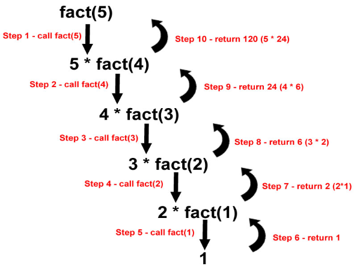

# Lab 11

## Goals:

- Learn recursion

Please, make sure that you have added the honor code statement at the top of your Java file:

```java
/*
  THIS CODE IS MY OWN WORK, IT WAS WRITTEN WITHOUT CONSULTING       
  CODE WRITTEN BY OTHER STUDENTS. _Your_Name_Here_
*/
```

## Preparation: Create your ~/cs170/lab11/, and copy files

```sh
bash
mkdir ~/cs170/lab11
cp  ~cs170001/share/lab11/*  ~/cs170/lab11
cd ~/cs170/lab11
```

## Intro

This lab will reinforce recursion which is traditionally a pretty complicated technique for students to master in Computer Science.

As discussed in class, a recursive method will invoke itself, but the invocation always uses a parameter value that is smaller that the original value.

Two main ideas of a recursion are:

- Recursion expression
- Base case (can be multiple)

Example: [`Factorial.java`](lab11/Factorial.java)

```java
public static int factorial(int n) {
  int sol1, mySol;

  /* the base cases */
  if (n == 0) {
    // The readily available solution for the base case
    return 1; 
  } else {

    // factorial(n) is solved using solutions of
    // the smaller problem factorial(n-1)...

    // Solve a smaller problem
    sol1 = factorial(n - 1);

    // Use the solution of the smaller problem
    // to solve the original problem
    mySol = n * sol1; 

    return mySol;
  }
}
```

### Recursion expression

The original parameter is n, and `factorial(n)` invokes itself with a smaller parameter value `(n−1)`.

The key in understanding recusive methods is recognizing that you are:

- ❌ "solving a smaller problem" to solve the original problem
- ⭕️ "using the solution of a smaller problem" to solve the original problem.

Example: 5! = 5 * 4!

Suppose we know that 4! = 24, then we can use the solution of this smaller problem (4!) to solve the original problem 20!



### Base case

In every recursive method, there is at least one or more base cases that must have been solved (i.e., you know the solution)

The readily solved problems are called base cases.

General rule: 

> If you use the solution of the smaller problem Problem(n − k) to solve the problem Problem(n), you will need k base cases.

### Structure of a recursive method

# DO NOT Memorize it! Never! Never! Never! 

The easiest recursive method uses one smaller problem to solve the original problem.

The structure of a recursive method to solve a problem of size `n` using the solution of a problem of size `n−1` is:

```
public static ReturnType solveProblem(int n) {
  ReturnType sol1, mySol;

  if ( n is a base case ) {
    return solution;     // A solution is available for a base case
  } else {
    sol1 = solveProblem ( n - 1 );
    mySol = solve problem of size n using solution sol1;
    return mySol;
  }
}
```

### Notice

- Recursive method can solve complicated problems, but also can be written in a really complicated way. (For example, the recursive call happened in object.)
- `System.out.println()` is worse than useless for debugging in recursion. (The stack might too deep)
- No guarantees in efficiency 
  - recursion vs dynamic programming
  - stack overflow 

## Assignment

#### Do not use any loops in assignments.


### assignment 1

#### Problem description

Write a recursive method `power(int a, int n)` that computes `a^n`

#### How to approach the problem?

1. What is the problem solved by the method ?

`power(a, n)` computes `a^n` (example: `power(2, 10)` computes 2^10)

2. What is a smaller problem of the same nature ?

`power(a, n-1)` computes `a^(n-1)`  (example: `power(2, 9)` computes 2^9) 

3. How can you use the solution of `power(a, n−1)` to solve the original problem?

If we are solving 2^10 and we know the solution 2^9 = 512, we can solve 2^10 as follows:
```
2 * 512
```
In general:

If we are solving an and we know the solution a^(n-1) = sol1, we can solve an as follows:
```
a * sol1
```

4. What is a base case that we have a ready solution?


`power(a, 0)` is equal to 1 (example: `power(2, 0)` is equal to 1)

Finish `power(int a, int n)` in [`Power.java`](lab11/Power.java)

### assignment 2

The most common smaller problem that a recursive method solves within itself uses the parameter `n−1` , but that is not always the case.

Problems involving strings that are solved by recursive method usually uses a shorter length `string`.

The most common smaller problem that a "string typed" recursive method solves within itself uses a `string` of shorter length `n−1`.

Here, we are going to practice a recursion exercise using "string" typed input.

#### Problem description

Given a non-negative number n.

#### How to approach the problem?

1. It is easier to describe the method by listing out the digits of a number. So I will use the notation to represent the fact that the number `n` consists of a number of digits `xyz` (it does not mean 3 digits, what I mean is: "some digits")

```
n = xyz
```

2. What is the problem solved by the method?

`sumDigits( n = xyz)` computes `x+y+z` (example:  `sumDigits(3412)` computes `3+4+1+2`)

3. What is a smaller problem of the same nature?

`sumDigits(n/10 = xy)` computes `x+y` (example: `sumDigits(341)` computes `3+4+1`)    

Note that:  341 = 3412/10 So the operation to shorten a number by 1 digit is "dividing by 10"

4. How can you use the solution of `sumDigits(n/10)` to solve the original problem?

If we are solving `sumDigit(3412)`, and we know the solution `sumDigit(341) = 8`, we can solve `sumDigit(3412)` as follows:

```
8 + 2 (2 = the least significant digit of 3412)
// or: 8 + (3412 % 10)
```

In general:

If we are solving `sumDigit(n=xyz)`, and we know the solution `sumDigit(n/10=xy)=sol1`, we can solve sumDigit( n = xyz ) as follows:

```
sol1 + z (z = the least significant digit of n = xyz)
// or: sol1 + (n % 10) 
```

5. What is a base case that we have a ready solution ?

`sumDigits(0)` is equal to 0

Finish `sumDigits(int n)` in [`SumDigits.java`](lab11/SumDigits.java)

## Submission

Upload the `Power.java` and `SumDigits.java` to Canvas.