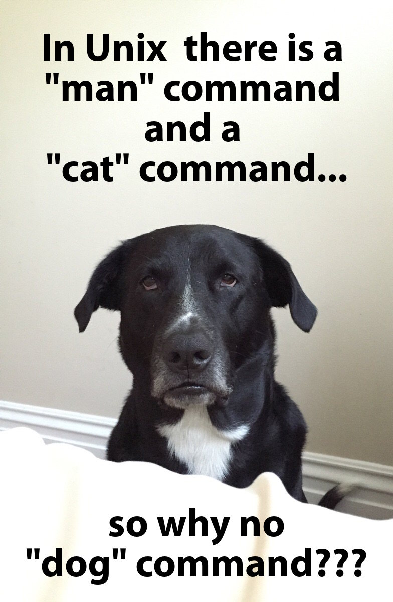

# Lab2

## Tasks:

1. Recall
2. More common linux commands
3. gedit
4. Assignment

## 1. Recall

- `pwd`: Print your current working directory 
- `ls`: List contents of the current directory\
- `cd`: Change directory
- `mkdir`/`rmdir`: Create/Remove a directory
- Symbol in UNIX system:

Symbol|Directory represented by the symbol
---|---
/ | The root directory
~ | The home directory of the user, for example: /home/glai2 
. | The current (working) directory
.. | The parent directory of the current directory
- Relative path is defined as path related to the present working directory(pwd).
- An absolute path is defined as the specifying the location of a file or directory from the root directory(/). In other words we can say absolute path is a complete path from start of actual filesystem from / directory.

**Don't have to memory it. Practice it!**

## 2. Getting started with a UNIX computer system (cont.)

First of all, change your shell to `bash`.
```
$ bash
```

#### stdout redirection (`>`)

- save `ls` result to a file
```sh
bash-4.1$ cd cs170
bash-4.1$ ls > dir.txt
```

#### Print out file content `cat`

- show the content in the `dir.txt`

```sh
bash-4.1$ pwd
/home/glai2/cs170
bash-4.1$ cat dir.txt
bob
dir.txt
sally
```

Do we have a `dog` command in linux?


- `cat` is a standard Unix utility that reads files sequentially, writing them to standard output. The name is derived from its function to con`cat`enate files.

However, there is a `tac` command, which is like `cat` command but in a reverse order. 

```sh
bash-4.1$ tac dir.txt
sally
dir.txt
bob
```

#### Rename and Move File `mv`

- Rename `dir.txt` to `ls.txt`

```sh
bash-4.1$ pwd
/home/glai2/cs170
bash-4.1$ mv dir.txt ls.txt
bash-4.1$ ls
bob  ls.txt  sally
bash-4.1$
```

- Move `photo` from `cs170/bob/` to `cs170/sally/`
- Move `music` from `cs170/sally/` to `cs170/bob/`

```sh
bash-4.1$ pwd
/home/glai2/cs170
bash-4.1$ ls bob/
photo
bash-4.1$ ls sally/
music
bash-4.1$ mv bob/photo sally/
bash-4.1$ ls sally/
music  photo
bash-4.1$ ls bob
bash-4.1$ mv sally/music bob/
bash-4.1$ ls sally/
photo
bash-4.1$ ls bob/
music
bash-4.1$
```

- If you don't specify a file name for the destination, the `mv` command uses the original filename. 
- You can move a file to a new destination and rename the file in the same command. 

#### Quiz: 

Now, how to move the `photo` from `sally/` to `bob/` and rename it as an `album`? 

Hint:
- What's your current working directory? 
- You should use an absolute or a relative path? 

#### Copy a file or files `cp`

- Copy `music` from `bob/` to `sally/`

```
bash-4.1$ pwd
/home/glai2/cs170
bash-4.1$ ls sally/
photo
bash-4.1$ cp bob/music sally/
bash-4.1$ ls sally/
music  photo
```

#### Remove a file or files `rm`

- Copy `music` from `bob/` to `sally/`

```
bash-4.1$ pwd
/home/glai2/cs170
bash-4.1$ ls sally/
music  photo
bash-4.1$ rm sally/music
bash-4.1$ ls sally/
photo
```

#### wildcard symbol (*)

- [How to Use Wildcards](http://www.linfo.org/wildcard.html)

#### How to be familiar with UNIX system?

- [Google](https://google.com)
- [Stackoverflow](https://stackoverflow.com/)

## Gedit & Assignment 

#### Preparation

```sh
$ mkdir ~/cs170/lab2
$ cp /home/cs170001/share/lab2/* ~/cs170/lab2/
$ cd ~/cs170/lab2
$ ls
Convert.java  Cylinder.java  HelloWorld.java
```

#### DEMO Gedit

#### Assignment

Edit the `Cylinder.java` and write the code to compute the volume and surface area of a cylinder. 

- Edit

```
gedit Cylinder.java & 
```

> Make sure you type the & character at the end of the command line !!!

- Check points
  - Program must `Scanner` (just like in the `Convert.java` program) to read from terminal:
    - the `radius` of the cylinder
    - the `height` of the cylinder
  - Define the variables needed to store the inputs (`radius` and `height`) provided by user
    - both these parameters can be fractional numbers (i.e. `double` type)
    - Use meaningful variable names!
  - Define a variable of type `double` called `pi` and initialize it to `3.14`.
  - Compute the `volume` and `surface area` of the cylinder and store the results in variables with meaningful names.
    - Hint:
    ```
    Volume = baseArea * height

    Surface = 2 * baseArea + (2 * radius * pi) * height  

    baseArea = radius * radius * pi
    ```
  - Using `System.out.println()` to print out the `volume` and the `surface area`.

Make sure you save your file

- Expected steps for running your program.
  - Open the terminal and go to the directory containing your program
  - Compile your program by
  ```
  $ javac Cylinder.java
  ```
    - If the compiler reports some errors, you must fix them using gedit. Save the changes and compile again until there are no errors.
  - Run the program by
  ```
  $ java Cylinder
  ```

Example: 

```
$ javac Cylinder.java
$ java Cylinder
Please enter the radius: 4.5
Please enter the height: 12.2
The volume of the cylinder = 775.737
The surface of the cylinder = 471.942
```

#### Submission 

Upload the `Cylinder.java` to Canvas, **NOT** `Cylinder.class`!!