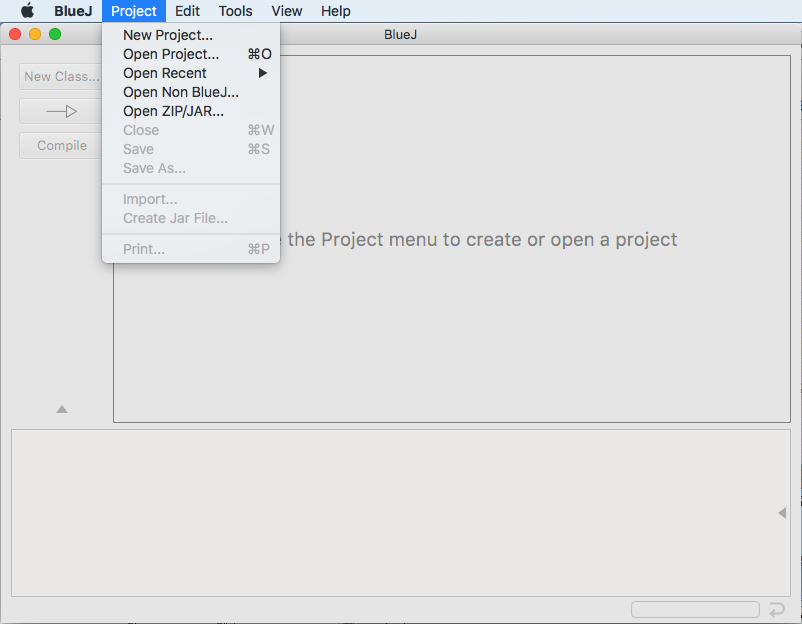

# Lab1 

## Lab reading material
- [Editing Java programs with BlueJ](http://www.mathcs.emory.edu/~cheung/Courses/170/Syllabus/02/BlueJ/BlueJ.html)
- [Using BlueJ with an existing Java program](http://www.mathcs.emory.edu/~cheung/Courses/170/Syllabus/02/BlueJ/BlueJ1a.html)
- [Compiling and running Java programs with BlueJ](http://www.mathcs.emory.edu/~cheung/Courses/170/Syllabus/02/BlueJ/BlueJ2.html)

## Goal:

Learn how to use BlueJ 

## Preparation:

```sh
$ mkdir ~/cs170/lab3
$ cp /home/cs170001/share/lab3/*.java ~/cs170/lab3/
$ cd ~/cs170/lab3
$ ls
Extra.java  FtoC.java
```

## BlueJ

#### Launch BlueJ

```
$ bluej &
```

#### Open Project ~/cs170/lab3

Project > Open Non BlueJ... > Select the directory `~/cs170/lab3` 




Now you should see the file `package.bluej` under `~/cs170/lab3` directory. 

#### Notes:

- The presence of the file package.bluej indicates that the directory is now a "BlueJ project".
  - Don't edit this file, because BlueJ uses it to store project details.
- If you remove the file package.bluej, then the directory becomes an ordinary directory (and is no longer a BleuJ project)
- Common problems experienced by students with BlueJ:
  - BlueJ will not browse a directory that is a BlueJ project
  - If you make a directory into a BlueJ project by mistake, you can undo this by remove the file package.bluej from that directory: 
  ```
  $ rm   DIRECTORY-PATH-NAME/package.bluej
  ```

#### A brief intro to method

Demo

#### Assignment

Temperature conversion (`FtoC.java`)

Hint: 

```
F = C * 9 / 5 + 32
```

- The deadline for completing this lab assignment is midnight, today.

Please, make sure that you have added the honor code statement at the top of the lab project file `FtoC.java` (that you will obtain per instructions below):

```
/*
THIS CODE IS MY OWN WORK, IT WAS WRITTEN WITHOUT CONSULTING     
CODE WRITTEN BY OTHER STUDENTS. _Your_Name_Here_
*/
```

Upload `FtoC.java` to Canvas.