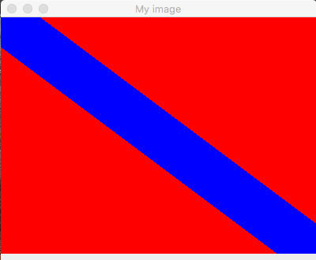

# Lab 9

## Goals:

- Nested for-statement

Please, make sure that you have added the honor code statement at the top of your Java file:

```java
/*
  THIS CODE IS MY OWN WORK, IT WAS WRITTEN WITHOUT CONSULTING       
  CODE WRITTEN BY OTHER STUDENTS. _Your_Name_Here_
*/
```

## Preparation: Create your ~/cs170/lab9/, and copy files

```sh
bash
mkdir ~/cs170/lab9
cp  ~cs170001/share/lab9/*  ~/cs170/lab9
cd ~/cs170/lab9
```

## Assignment

In this lab, students must write several nested for-statement to put color value in a 2-dimensional array.
The result is as follows:


**We only use gedit today!**

#### File description 

- `MyCanvas.java`
  - This program contains the neccesary programs to make a 400x300 picture using data from a 2-dimensional array.
  - Specifically, it contains a method called draw() that draws a 400x300 picture using data from an 2-dimensional array that you pass to the method.
  - Do NOT make any changes to this program.

- `DrawFlag.java`
  - This program contains a 400x300 (2-dimensional) array named pixel (edit the DrawFlag.java program and look for the following line):
    ```java
    int[][] pixel = new int[400][300];            
    ```
    This array contain the pixel color values for a 400x300 picture.
  - Furthermore, the `DrawFlag.java` program will invoke the `draw()` method in the `MyCanvas.java` program to draw a 400x300 picture using data in the array pixel:
    ```java
    /* ===============================================================
       DO NOT touch this statement (that draw the picture)
       =============================================================== */
    pic.draw( pixel );
    pic.repaint();   // Repaint the frame
    ```

- Intro to making drawing with the pixel array

First, compile the `DrawFlag.java` program and run it using these commands:

```
$ javac  DrawFlag.java 
$ java  DrawFlag
```


Next, try to find these line and add the for loop

```java
/* ==========================================================
  Try this:

  for ( col = 0; col < 400; col++ ) {
      pixel[col][100] = RED;
  }
========================================================== */ 
for ( col = 0; col < 400; col++ ) {
  pixel[col][100] = RED;
}
```

Compile the `DrawFlag.java` program and run it using these commands:

```
$ javac  DrawFlag.java 
$ java  DrawFlag
```


#### Part 1 Make the 400x300 canvas red

Look for the first TODO

Write a nested for-statement that write the color value `RED` all 400x300 elements of the pixel variable.
Use the `row` variable to run through the value 0 to 299 and use the `col` variable to run through the value 0 to 399, and store the value `RED` to the variable pixel[col][row].

Compile the `DrawFlag.java` program and run it using these commands:

```
$ javac  DrawFlag.java 
$ java  DrawFlag
```


#### Part 2 Make a top-left to bottom-right blue diagonal

Look at the properties of a coordinate point (`col`,`row`) on 3 different lines in this figure:


The coordinate points on the diagonal from (0,0) to (400,300) satisfies the Mathematical equation:

```
3*col - 4*row = 0
```

The coordinate points on the diagonal line above the diagonal from (0,0) to (400,300) satisfies the Mathematical equation:

```
3*col - 4*row = 150
```

The coordinate points on the diagonal line below the diagonal from (0,0) to (400,300) satisfies the Mathematical equation:
```
3*col - 4*row = -150
```

Therefore, a coordinate points lies between the lines `3*col - 4*row = -150` and `3*col - 4*row = 150` will satisfy this Mathematical inequaty:

```
-150  <= 3*col - 4*row <= 150
```

TODO:

Write a nested for-loop that go through every single coordinate (`col`, `row`) and change the pixel value in `pixel[col][row]` to `BLUE` if:

```
-150 <= 3*col - 4*row <= 150
```

Compile the `DrawFlag.java` program and run it using these commands:

```
$ javac  DrawFlag.java 
$ java  DrawFlag
```




#### Part 2 Make a top-right to bottom-left blue diagonal


The coordinate points on the diagonal from (0,300) to (400,0) satisfies the Mathematical equation:

```
3*col + 4*row = 1200
```

Find the equation for the other 2 lines and formulate a property for a coordinate (col, row) between the top and bottom lines.

Then write a nested for-loop to draw this diagonal.

After writing the code, you can compile and run the program with these commands:


```
$ javac  DrawFlag.java 
$ java  DrawFlag
```


#### Submission

Upload the `DrawFlag.java` to Canvas.